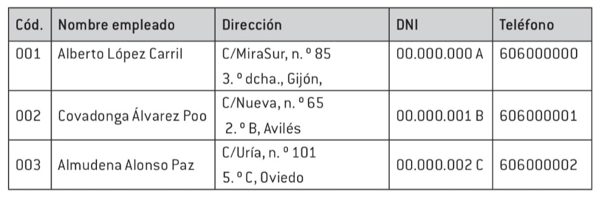

# Bases de datos relacionales no complejas

Contenido

2.1. Concepto de sistema gestor de almacenamiento de datos.  

2.2. Planificación y diseño de un sistema gestor de base de datos.

### Características

Un sistema gestor de almacenamiento de datos (SGBD) es un conjunto de programas que permiten manejar la información de una base de datos. Estos programas permiten almacenar, modificar y extraer datos, además de proporcionar herramientas para realizar tareas como agregar, eliminar, modificar y analizar datos.

Algunas características de un SGBD son:

1. Abstracción de la información: el usuario no necesita preocuparse por los detalles de cómo se almacenan físicamente los datos. El SGBD se encarga de todos esos detalles técnicos.

2. Integridad: se implementan medidas para evitar la pérdida de datos almacenados y protegerlos de fallos de hardware, errores de entrada de datos o cualquier otra circunstancia que pueda corromper la información almacenada.

3. Seguridad: se garantiza que la información se mantenga segura ante usuarios malintencionados que intenten acceder a información privilegiada, ataques que busquen manipular o destruir datos, o errores de usuarios autorizados. Los SGBD tienen sistemas de permisos que permiten otorgar categorías de acceso a usuarios y grupos de usuarios, incluso en diferentes niveles de seguridad según el tipo de información.

4. Consistencia: se asegura que los datos ingresados sean correctos, por ejemplo, que no se permita ingresar un salario negativo. El SGBD muestra una advertencia si se intenta ingresar un valor no válido para un campo específico, asegurando que la información ingresada sea correcta en todo momento.

5. Redundancia mínima: se busca evitar la repetición o redundancia de información en una base de datos. Idealmente, se busca eliminar por completo la redundancia, pero en algunos casos es necesaria.

6. Independencia: se permite modificar la estructura de una base de datos sin tener que realizar cambios en las aplicaciones que la utilizan.

7. Rapidez: los SGBD ofrecen tiempos de respuesta rápidos ante consultas, modificaciones o ingreso de datos.

8. Respaldo y recuperación: los SGBD proporcionan métodos eficientes para realizar copias de seguridad de la información almacenada y recuperar datos en caso de pérdida.

9. Control de la concurrencia: en entornos donde múltiples personas acceden a la base de datos simultáneamente, el SGBD se encarga de controlar el acceso concurrente para evitar inconsistencias en los datos.

### Estrutura de una base de datos 

La información en las bases de datos se organiza en tablas, que tienen una estructura de dos dimensiones: campos y registros. 

- Los campos son el nombre y tipo de información que se almacena en la tabla. Cada campo contiene el mismo tipo de información, y se muestra en las columnas de la tabla. Por ejemplo, en una base de datos de empleados, el campo "Nombre empleado" contendría los nombres de los empleados, no fechas de nacimiento o direcciones.

- Los registros son las entradas de datos en la tabla. Cada registro contiene información de varios campos. Por ejemplo, un registro en la tabla de empleados podría incluir el nombre del empleado, su dirección y su NIF.

Cada columna de la tabla representa un campo y cada fila representa un registro. Para los usuarios, las tablas de datos se ven similar a una tabla en Word o Excel, pero tienen un comportamiento más restrictivo en cuanto a filas y columnas.

En la tabla anterior: los campos son constantes, no cambian en número ni en características. Lo que sí cambian son los registros, que se actualizan continuamente añadiendo, eliminando o modificando datos de los empleados.

Al diseñar los campos, se pueden establecer restricciones para asegurar que los datos introducidos sean válidos. Por ejemplo, en el campo "Nombre" se puede poner la restricción de que no se pueden introducir números, evitando así que se añada por error un número de teléfono en ese campo.

Además, se pueden automatizar algunas acciones al introducir los datos en la tabla. Por ejemplo, se puede crear una máscara de entrada en la que los primeros tres dígitos del número de teléfono sean siempre "606", lo que ahorra tiempo al no tener que introducir esos tres dígitos en cada registro. 

### Diccionario de datos 

Diccionario de datos en los sistemas de gestión de bases de datos:

1. Definición: El diccionario de datos es un componente esencial en los sistemas de gestión de bases de datos (SGDB) y contiene información sobre todos los datos que forman parte de la base de datos.

2. Estructura física y lógica: El diccionario de datos proporciona detalles sobre la estructura física de la base de datos, como los archivos del sistema operativo. También incluye la estructura lógica, que se refiere a cómo están organizados los datos, sin mencionar la forma de almacenamiento o los métodos de acceso físico a los datos.

3. Definiciones de objetos: El diccionario de datos almacena las definiciones de todos los objetos de la base de datos, como tablas, vistas, índices, procedimientos, funciones, entre otros.

4. Espacio asignado y utilizado: Proporciona información sobre el espacio asignado y utilizado por los objetos de la base de datos.

5. Valores por defecto: El diccionario de datos guarda los valores por defecto de las columnas de las tablas.

6. Restricciones de integridad: Contiene información acerca de las restricciones de integridad que se aplican a los datos de la base de datos.

7. Privilegios y roles: Almacena los privilegios y roles otorgados a los usuarios de la base de datos.

8. Auditoría de información: El diccionario de datos registra información de auditoría, como los accesos a los objetos de la base de datos.

### El/la administrador

Las responsabilidades y tareas del administrador del sistema de gestión de bases de datos. Se pueden resumir de la siguiente manera:

1. El administrador es un componente humano importante en el resultado del uso de las bases de datos.
   
2. El administrador tiene responsabilidades en la definición, administración, seguridad, privacidad e integridad de la información en el sistema de gestión de bases de datos.
   
3. Tareas del administrador incluyen la instalación, arranque y parada del sistema de gestión de bases de datos, carga de bases de datos, definición del esquema físico y lógico, definición de subesquemas, control de privacidad de datos, mantenimiento de esquemas, procedimientos de seguridad, vigilancia del trabajo, control de tasas de uso y tiempos de acceso, reorganización de la base de datos si es necesario, copias de seguridad periódicas, restauración de la base de datos después de un incidente, auditorías del sistema y optimización de la base de datos.
   
4. El administrador tiene el máximo nivel de privilegios y es responsable de dar de alta a los usuarios y asignarles tipos y permisos de acceso.

Es importante tener un número mínimo de administradores de bases de datos para mantener la seguridad y control adecuados.

### Lenguajes de consultas de BD

El proceso de programación en bases de datos es necesario para diseñar, escribir, comprobar y mantener un sistema gestor de bases de datos. 

Esto implica no sólo el diseño de las tablas y la inserción de datos, sino también la programación de herramientas para consultar y modificar la información de la base de datos. 

SQL es uno de los lenguajes de consultas "y programación" más comunes y poderosos en bases de datos.

Los sistemas de gestión de bases de datos comerciales suelen incluir tareas preprogramadas o asistentes para facilitar la programación, por lo que los usuarios no necesitan ser expertos en programación. Sin embargo, si es necesario realizar programación, generalmente es realizada por el administrador de la base de datos o una empresa externa contratada.

**DDL** : Los lenguajes de definición de datos permiten la representación lógica de los datos y son utilizados para describir la base de datos, realizar modificaciones en su estructura y definir reglas de integridad y autorizaciones de acceso.

**DML**: Los lenguajes de manipulación de datos están orientados al proceso y extracción de información almacenada en la base de datos. Se utilizan para añadir, modificar o eliminar registros.

**DCL**: El lenguaje de control de datos permite regular el acceso de los usuarios a los datos, concediendo o suprimiendo privilegios según sea necesario.

## LibreOffice Base

Registrar la base de datos: SI --> No significa que la debo registrar en ninguna web, sinó que registrarla dentro de la instalación local de Libre Office para que **el resto de programas de Libre Office la puedan usar como fuente de datos**.

Extensión archivo: **odb**

Cuidado con _.odb.lck_ !!

1. Visión General
2. Tablas
3. Consultas
4. Formularios
5. Reportes

https://www.youtube.com/watch?v=qZG2d5gFyos&list=PLJmelNtUJzhHETmjvOHRpvXTMYseaY6BV

